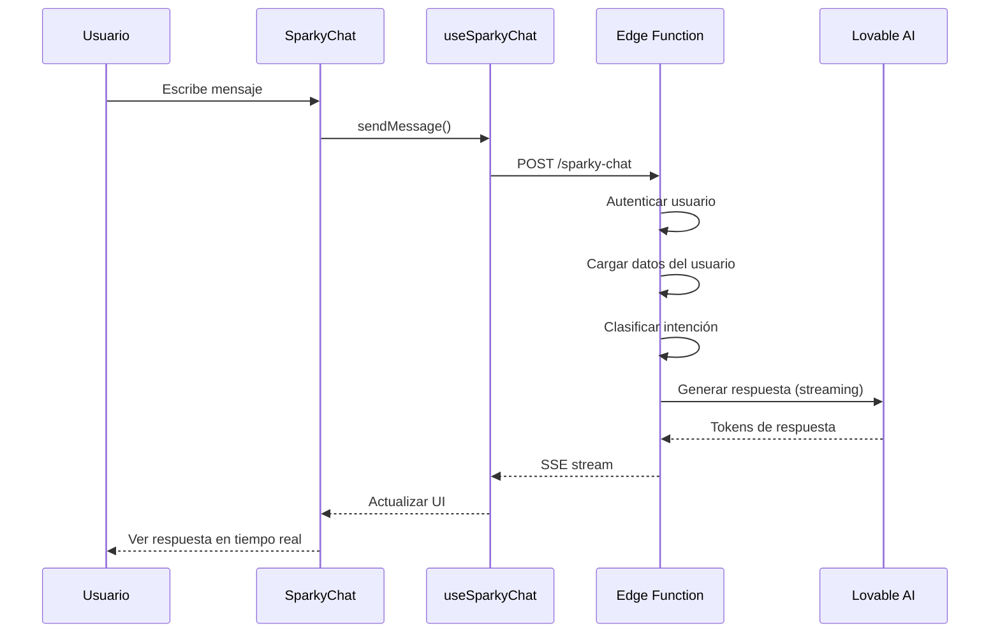
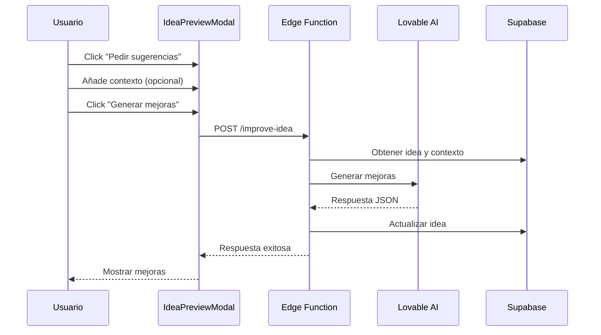

# Sparky - Asistente de IA Personal

## ¿Qué es Sparky?

Sparky es un asistente de inteligencia artificial integrado en la aplicación que actúa como un compañero inteligente para ayudar a los usuarios a organizar sus ideas, tareas, proyectos y vida personal. No es un simple chatbot genérico, sino un asistente contextual que conoce toda la información del usuario y puede proporcionar respuestas personalizadas y relevantes.

---

## Características Principales

### 1. **Múltiples "Cerebros" Especializados**

Sparky cuenta con diferentes personalidades o modos de operación que se activan automáticamente según el tipo de conversación:

| Cerebro | Clave | Descripción |
|---------|-------|-------------|
| 🧠 **Organizador** | `brain_organizer` | Ayuda con la gestión de tareas, proyectos y productividad |
| 🎯 **Mentor** | `brain_mentor` | Ofrece orientación, consejos y apoyo para el desarrollo personal |
| 💡 **Creativo** | `brain_creative` | Estimula la creatividad y ayuda con brainstorming de ideas |
| 💼 **Negocios** | `brain_business` | Asesora en temas de emprendimiento y estrategia empresarial |
| 😊 **Casual** | `brain_casual` | Conversación amigable y relajada |

### 2. **Contexto RAG (Retrieval-Augmented Generation)**

Sparky utiliza tecnología RAG para acceder y utilizar toda la información del usuario:

- **Tareas**: Pendientes, vencidas, completadas recientemente
- **Ideas**: Todas las ideas capturadas con sus metadatos
- **Proyectos**: Proyectos activos y su progreso
- **Diario**: Entradas recientes del diario personal
- **Personas**: Contactos y relaciones del usuario
- **Patrones**: Patrones de comportamiento detectados
- **Memorias**: Información persistente sobre el usuario

### 3. **Sugerencias de Mejora para Ideas**

Sparky puede analizar ideas individuales y sugerir mejoras basándose en:

- El contenido de la idea
- Otras ideas relacionadas del usuario
- Proyectos activos
- Contexto adicional proporcionado por el usuario

---

## Arquitectura Técnica

### Edge Functions

#### `sparky-chat` (Chat Principal)

```
Ubicación: supabase/functions/sparky-chat/index.ts
```

**Flujo de funcionamiento:**

1. **Autenticación**: Verifica el token JWT del usuario
2. **Recolección de datos**: Obtiene todos los datos del usuario desde Supabase
3. **Clasificación de intención**: Usa IA para determinar qué "cerebro" usar
4. **Carga de prompts**: Recupera los prompts del sistema desde la tabla `system_prompts`
5. **Construcción de contexto RAG**: Formatea todos los datos del usuario en un resumen
6. **Generación de respuesta**: Llama a la API de IA con streaming habilitado
7. **Respuesta en tiempo real**: Transmite la respuesta token por token

**Modelo de IA utilizado**: `google/gemini-2.5-flash` (vía Lovable AI Gateway)

#### `improve-idea` (Mejora de Ideas)

```
Ubicación: supabase/functions/improve-idea/index.ts
```

**Flujo de funcionamiento:**

1. **Autenticación**: Verifica el token JWT del usuario
2. **Recuperación de datos**: Obtiene la idea específica, otras ideas y proyectos activos
3. **Construcción del prompt**: Crea un prompt detallado con el contexto de la idea
4. **Generación de mejoras**: Solicita mejoras en formato JSON estructurado
5. **Actualización de base de datos**: Guarda las sugerencias en la tabla `ideas`

**Formato de respuesta:**

```json
{
  "improvements": [
    {
      "version": "Versión 1.0",
      "content": "Contenido mejorado...",
      "reasoning": "Explicación de por qué..."
    }
  ],
  "connections": ["Conexiones con otras ideas o proyectos"],
  "nextSteps": ["Pasos siguientes sugeridos"]
}
```

---

### Frontend

#### Hook: `useSparkyChat`

```
Ubicación: src/hooks/useSparkyChat.ts
```

**Funcionalidades:**

- `sendMessage(message)`: Envía un mensaje y recibe respuesta con streaming
- `clearChat()`: Limpia el historial de conversación
- `messages`: Lista de mensajes de la conversación
- `isLoading`: Estado de carga
- `streamingMessage`: Mensaje en proceso de streaming

**Características técnicas:**

- Persistencia de mensajes en tabla `sparky_messages`
- Soporte para Server-Sent Events (SSE)
- Manejo de cancelación de requests
- Gestión del historial de conversación

#### Componente: `SparkyChat`

```
Ubicación: src/components/chat/SparkyChat.tsx
```

**Características de UI:**

- Modal de chat con diseño moderno
- Indicadores visuales del cerebro activo (colores y etiquetas)
- Renderizado de Markdown en respuestas
- Separadores de fecha para mensajes
- Sugerencias iniciales para nuevas conversaciones
- Animación de streaming en tiempo real
- Botón para limpiar conversación

---

## Base de Datos

### Tablas Principales

#### `sparky_messages`

Almacena el historial de conversaciones:

| Campo | Tipo | Descripción |
|-------|------|-------------|
| `id` | UUID | Identificador único |
| `user_id` | UUID | Usuario propietario |
| `role` | string | "user" o "assistant" |
| `content` | string | Contenido del mensaje |
| `brain` | string | Cerebro utilizado (solo para assistant) |
| `created_at` | timestamp | Fecha de creación |

#### `system_prompts`

Almacena los prompts configurables:

| Campo | Tipo | Descripción |
|-------|------|-------------|
| `id` | UUID | Identificador único |
| `key` | string | Clave del prompt (ej: "brain_organizer") |
| `name` | string | Nombre descriptivo |
| `prompt` | string | Contenido del prompt |
| `model` | string | Modelo de IA a usar |
| `temperature` | number | Temperatura para generación |
| `is_active` | boolean | Si está activo |

#### `ideas` (campos relevantes para Sparky)

| Campo | Tipo | Descripción |
|-------|------|-------------|
| `suggested_improvements` | JSON | Mejoras sugeridas por Sparky |
| `next_steps` | JSON | Pasos siguientes sugeridos |

---

## Flujo de Usuario

### Chat con Sparky



### Mejora de Ideas



---

## Configuración de Prompts

Los prompts de Sparky se almacenan en la tabla `system_prompts` y pueden ser editados desde el panel de administración. Cada prompt debe incluir:

1. **Personalidad base**: Cómo debe comportarse Sparky
2. **Instrucciones específicas**: Para cada tipo de cerebro
3. **Formato de respuesta**: Cómo estructurar las respuestas
4. **Uso del contexto**: Cómo aprovechar los datos del usuario

### Prompt Selector

Un prompt especial (`brain_selector`) se encarga de clasificar la intención del usuario:

```
Clasifica el mensaje del usuario en una de estas categorías:
- organizer: tareas, proyectos, productividad
- mentor: consejos, desarrollo personal
- creative: ideas, brainstorming
- business: emprendimiento, estrategia
- casual: conversación general
```

---

## Seguridad

- **Autenticación JWT**: Todas las requests requieren token válido
- **RLS (Row Level Security)**: Los usuarios solo acceden a sus propios datos
- **Datos en tránsito**: HTTPS obligatorio
- **Sin exposición de API keys**: Las claves se manejan en edge functions

---

## Limitaciones Actuales

1. No puede ejecutar acciones directas (crear tareas, etc.) - solo conversa
2. El historial de contexto se limita a los últimos 20 mensajes
3. Las mejoras de ideas requieren regeneración manual
4. No hay memoria a largo plazo entre sesiones de chat

---

## Futuras Mejoras Posibles

- [ ] Tool calling para acciones directas (crear tareas, ideas, etc.)
- [ ] Selección manual del cerebro
- [ ] Entrada de voz
- [ ] Memoria persistente entre sesiones
- [ ] Proactividad (sugerencias sin solicitar)
- [ ] Integración con calendario
- [ ] Resúmenes automáticos diarios/semanales

---

## Referencias de Código

| Archivo | Descripción |
|---------|-------------|
| `supabase/functions/sparky-chat/index.ts` | Edge function principal del chat |
| `supabase/functions/improve-idea/index.ts` | Edge function para mejoras de ideas |
| `src/hooks/useSparkyChat.ts` | Hook React para gestión del chat |
| `src/components/chat/SparkyChat.tsx` | Componente UI del chat |
| `src/components/ideas/IdeaPreviewModal.tsx` | Modal con integración de mejoras |
